# Deployment Proof - Terraform on Azure

This walkthrough shows the full lifecycle: **terraform init → plan → apply → Azure portal resources**.  
The goal is to demonstrate Infrastructure as Code (IaC) provisioning on Azure using **Terraform**.

> Sensitive details (subscription ID, public IPs) are blurred or redacted.

---

## 1) Terraform Init
Initialises the working directory and downloads the AzureRM provider, preparing Terraform to work with Azure.  
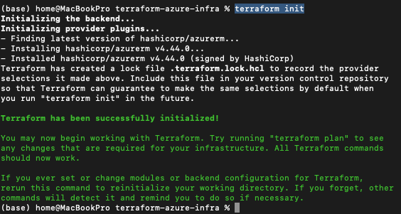

## 2) Terraform Plan
Generates an execution plan, showing the resources to be created: resource group, VNet, subnet, NSG, public IP, NIC, and VM.  
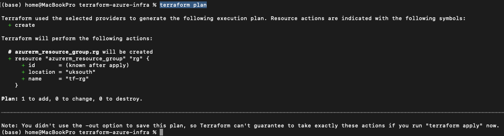

## 3) Terraform Apply
Applies the plan and provisions all defined resources into Azure.  
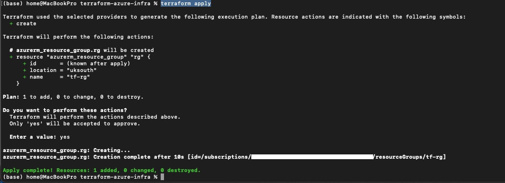

---

## 4) Resource Group
The resource group `tf-rg` acts as the logical container for all deployed resources.  
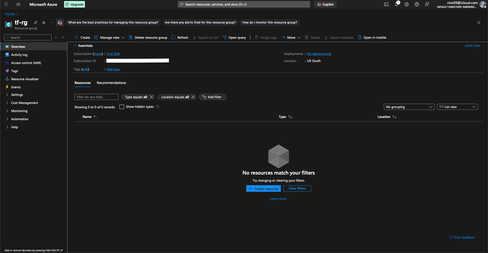

## 5) Virtual Network
The VNet `tf-vnet` provides private networking for resources, using CIDR block `10.0.0.0/16`.  
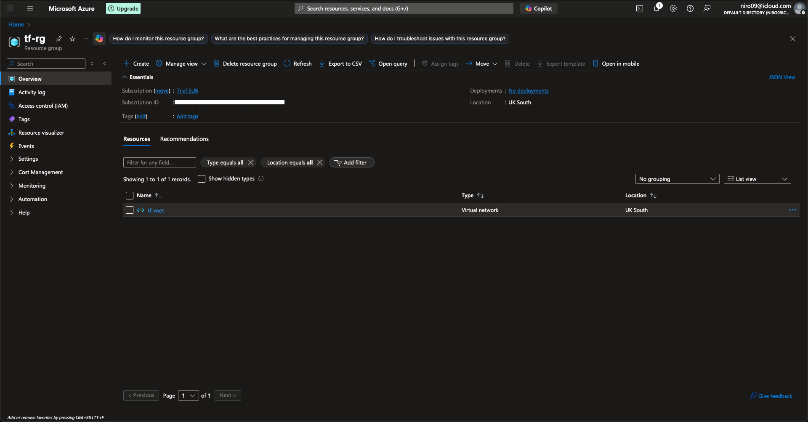

## 6) Subnet
Subnet `tf-subnet` isolates a smaller range (`10.0.1.0/24`) within the VNet.  
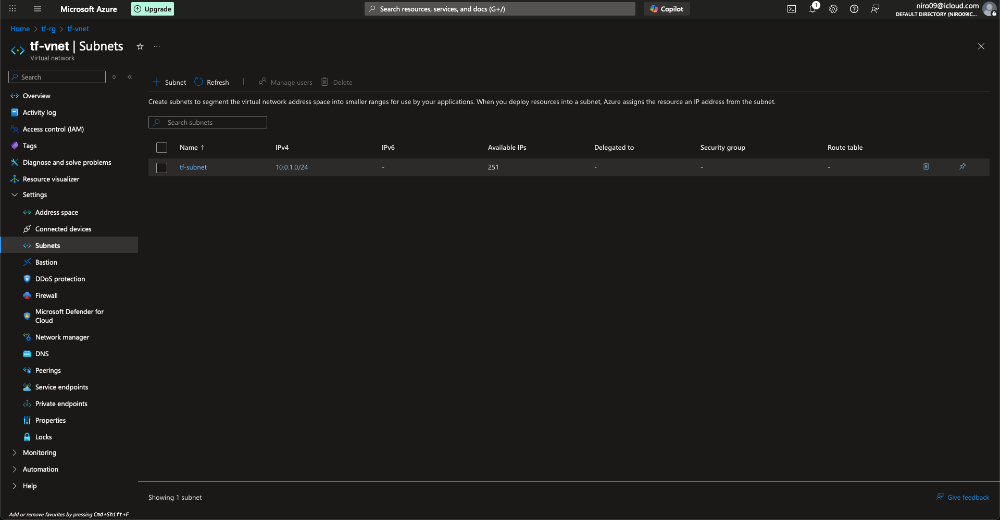

## 7) Network Security Group
NSG `tf-nsg` is associated with the subnet, allowing inbound SSH (22) and HTTP (80) traffic for demo purposes.  
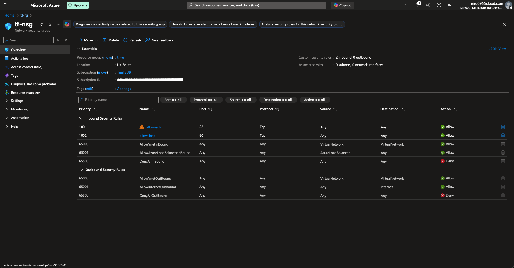

## 8) Public IP
A static public IP is allocated (Standard SKU), required for external connectivity to the VM.  
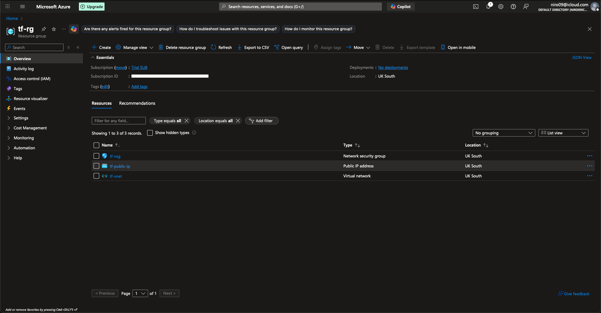

## 9) Network Interface
NIC `tf-nic` connects the VM to the subnet and binds it to the public IP.  
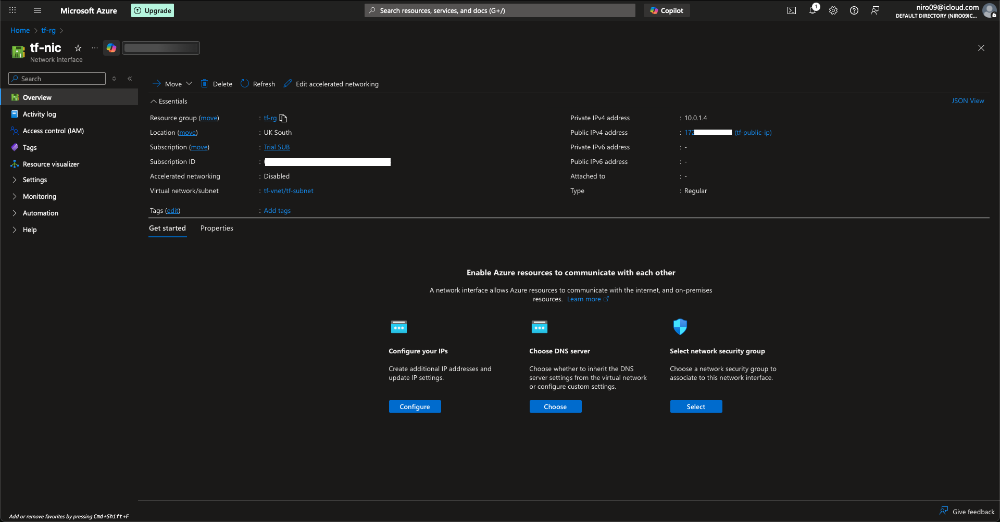

## 10) Virtual Machine
Linux VM `tf-vm` is deployed (Ubuntu 20.04, size `Standard_B1s`) and tagged for environment tracking.  
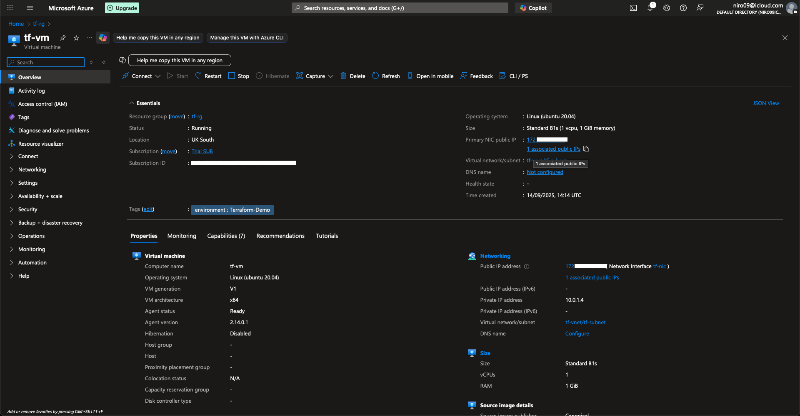

## 11) Activity Log
Azure Activity Log confirms the creation of all resources through Terraform automation.  
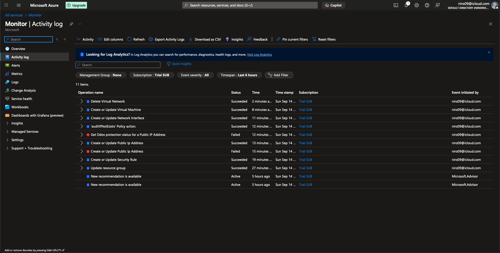
---
## Summary
This deployment demonstrated how Terraform can be used to provision core Azure infrastructure in minutes.  
--> Key resources included: a resource group, VNet + subnet, NSG, public IP, NIC and a Linux VM.  
Infrastructure as Code makes deployments repeatable, auditable and scalable compared to manual portal configuration.
